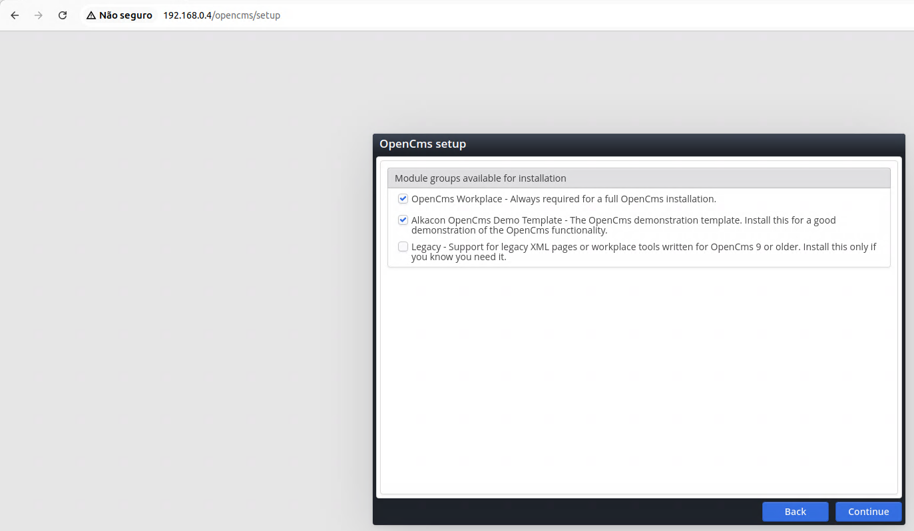
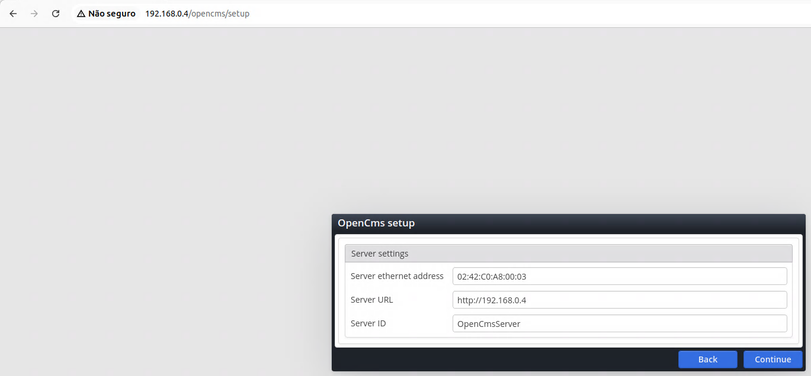

# Desafio


## Índice

1. [Introdução](#1-introdução)  
2. [Especificações](#2-especificações)  
3. [Topologia simplificada](#3-topologia-simplificada)  
4. [Pré requisitos](#4-pré-requisitos)  
5. [Procedimento técnico](#5-procedimento-técnico)  
    5. 1. [Primeira etapa - OpenCMS](#5-1-primeira-etapa---opencms)  
    5. 2. [Segunda etapa - PostgreSQL](#5-2-segunda-etapa---postgresql)  
    5. 3. [Terceira etapa - instalação do OpenCMS](#5-3-terceira-etapa---instalação-do-opencms)  
    5. 4. [Quarta etapa - Nginx](#5-4-quarta-etapa---nginx)  
6. [containerização](#6-containerização)  
7. [Referências](#7-referênciasreferencias)

---

## 1. Introdução

Essa documentação tem por objetivo documentar a entrega do teste técnico solicitado, assim como tornar transparente a implementação do OpenCMS e a utilização do Nginx como proxy reverso a fim de contemplar o encaminhamento de acessos recebidos para a aplicação, farei uma apresentação guiada, assim como evidenciarei artefatos do procedimento de implementação do OpenCMS.


## 2. Especificações

O objeto de entrega é o acesso ao OpenCMS através do NGINX como proxy reverso. Onde:

- Deve existir a instalação e configuração do OpenCMS utilizando o PostgreSQL como banco de dados.

- O sistema operacional do servidor (uma máquina virtual, ou VM) deve ser Linux.

- Deve existir o acesso a aplicação através de um proxy reverso Nginx


## 3. Topologia simplificada


- Nginx – Proxy Reverso:  
    Hostname: debian-proxy  
    IPV4: 172.20.0.88/24  
    DNS: proxy.local  

- Nginx – Proxy Reverso:  
    Hostname: debian-proxy  
    IPV4: 172.20.0.88/24  
    DNS: proxy.local  

- App Server:  
    Hostname: debian-app  
    IPV4: 172.20.0.89/24  
    DNS: opencms.local  

- Data Base Server:  
    Hostname: debian-db  
    IPV4: 172.20.0.74/24  
    DNS: database.local  

A escolha dessa arquitetura foi devido ao fato da facilidade de manutenções futuras, troubleshooting em caso de necessidade de inspeção de erros e tracing de logs, tendo cada recurso isolado em uma VM própria para cada serviço podemos ser mais assertivos em atualizações futuras além de diminuir o acoplamento de recursos em um único servidor.


## 4. Pré requisitos

- 3 VMs Linux 
- Java JDK, versão 5 ou superior
- Tomcat
- PostgreSQL
- OpenCMS
- Nginx


## 5. Procedimento técnico

Iniciei o procedimento técnico com a instalação do servidor de aplicação OpenCMS, para isso considerarei que já provisionamos uma máquina Debian que será usada como base para a instalação das outras VMs, as especificações escolhidas para cobrir esse caso são:

- VM Template
    Debian 11  
    4 Vcpus  
    4 GB ram  
    50 GB disk  

Vale ressaltar que disponibilizei os arquivos de configuração nas pastas subjacentes ao repositório.

```shell
cat /etc/os-release
```


```shell
free -h
```


```shell
df -h --total
```


```shell
lscpu | head -n 10
```


Considerarei também que o sistema estará com as últimas atualizações instaladas e para garantir isso faremos a atualização do sistema com o comando:
```shell
sudo apt update && sudo apt upgrade -y
```

Também farei a instalação do editor de textos VIM com o comando:
```shell
sudo apt-get install vim
```

E editarei o arquivo “/etc/hosts” usando a ferramenda VIM, de modo que a configuração final fique semelhante a essa em todas as VMs:


Segue abaixo o teste de comunicação entre as VMs:


A partir desse ponto o processo será dividido em quatro etapas para facilitar o entendimento e eventuais consultas;

### 5. 1. Primeira etapa - OpenCMS

Uma vez que a comunicação entre as máquinas está confirmada, dou sequencia ao deploy do OpenCMS e para isso fiz a instalação dos componentes pré requisitos para o correto funcionamento da aplicação, são eles:

- Java JDK
    Procurei qual versão estava disponível no repositório padrão do Debian utilizando o comando:

    ```shell
    sudo apt-cache search openjdk | grep jdk 
    ```

    A versão 17 me surgiu como a melhor escolha por ser a mais recente e estável disponível no repositório padrão, realizei a instalação com o seguinte comando:

    ```shell
    sudo apt-get install openjdk-17-jdk -y
    ```

    

- Tomcat9

    A escolha do Tomcat seguiu a mesma linha de raciocínio do Java, procurei no repositório padrão, com o comando:
    
    ```shell
    sudo apt-cache search tomcat
    ```

    Optei por instalar a versão estável disponível e realizei a instalação com o comando:

    ```shell
    sudo apt-get install tomcat9 -y
    ```

    ```shell
    sudo /usr/share/tomcat9/bin/version.sh
    ```

    

    Caso a instalação tenha sido bem sucedida será possível acessar o caminho especificado anteriormente na porta padrão de escuta do Tomcat conforme imagem abaixo:

    


Para a aquisição da aplicação criei uma pasta chamada /root/opencms com o comando:

```shell
mkdir /root/opencms && cd /root/opencms
```

e utilizei a ferramenta wget para baixar a versão atual do OpenCMS diretamente do site ofical para a pasta citada:

```shell
wget http://www.opencms.org/downloads/opencms/opencms-17.0.zip
```

Neste ponto precisei de algumas ferramentas adicionais que não vem instaladas por padrão no Debian, são elas a “zip e unzip” o comando de instalação das mesmas é o que se segue:

```shell
sudo apt-get install zip unzip -y
```

utilizei o comando unzip para descompactar o arquivo baixado:

```shell
unzip opencms-17.0.zip
```

entre os arquivos descompactados existe um arquivo chamado “opencms.war” esse arquivo deve ser movido para a pasta padrão de sites do servidor web Tomcat que no caso é a ***“/var/lib/tomcat9/webapps”***, a partir desse ponto segui com a instalação através do painel web disponibilizado pela aplicação que pode ser acessado no endereço padrão do Tomcat + endereço da aplicação sendo assim:

> http://opencms.local:8080/opencms/setup


Após o aceite dos temos, nos depararemos com a seguinte tela:


E se for bem sucedido na etapa anterior, seguiremos para a etapa de conexão com o banco de dados com a seguinte tela:


Vale lembrar que usarei um banco de dados PostgreSQL, portanto selecionei a opção correspondente ao postgres.

Encerrei aqui a primeira etapa para a instalação do OpenCMS. Para a segunda etapa será necessário a instalação do banco de dados, portanto a partir desse ponto darei seguimento no provisionamento da VM do banco de dados.


### 5. 2. Segunda etapa - PostgreSQL

Tomando o sistema Debian padrão como base e para simplificar a adoção do banco de dados PostgreSQL, utilizri a mesma linha de raciocínio para instalação do PostgreSQL, pesquisei o repositório padrão e nos decidi pela versão com suporte para casos de intervenções futuras, seguem os comando utilizados abaixo:

Comando para buscar e filtrar os resultados de PostgreSQL:

```shell
apt-cache search postgresql | grep postgre | head -n 15”
```

Comando utilizado para instalar o PostgreSQL e seus adicionais:

```shell
sudo apt-get install postgresql postgresql-contrib -y
```

Após a instalação utilizarei a conta ***“postgres”*** que já existe e possui permissões de criação de banco de dados no servidor, assim, irei alterar a senha por conveniência. Esse usuário será utilizado na etapa de conexão com o banco de dados na interface web do OpenCMS. O procedimento seguiu os passos a seguir:

elevei as permissões de usuário ao me tornar root com o comando:

```shell
sudo -i
```
Entrei no usuário ***"postgres"***:

```shell
su - postgres
```

Após isso entrei na interface de linha de comando do PostgreSQL

```shell
psql
```

Alterei a senha do ususário “postgres” para “senha” com o comando:

```shell
ALTER USER postgres WITH PASSWORD 'senha';
```

Sai da linha de comando e retornei ao usuário root:

```shell
\q
```

```shell
exit
```

Ainda sobre o PostgreSQL, para que exista comunicação entre o Debian onde está instalado o OpenCMS e a outra VM onde está o Banco de dados para com o SGBD é necessário alterar alguns arquivos de configuração para permitir o acesso através de outro host, segue o passo a passo de como realizar essas alterações:

Como root entrei na seguinte pasta com o comando:

```shell
cd /etc/postgresql/13/main/
```

Editei o arquivo ***"postgresql.conf"***:

```shell
vim postgresql.conf
```

Encontrei a linha “listen_addresses” e modifiquei para adicionar a porta de escuta no host desejado, confome a imagem abaixo:


Também foi necessário alterar as permissões de acesso a host externo no arquivo  ***“pg_hba.conf”*** que se encontra na mesma pasta e adicionei essa sentença no arquivo:

> host    all             all             opencms.local             md5

após salvar os arquivos e reiniciei o serviço do postgresql com o comando:

```shell
systemctl restart postgresql
```


após isso confirmei que o serviço está sendo escutado na porta correta com o comando

```shell
ss -nltp
```


Finalizada a instalação do Banco de dados, assim como dos requisitos para a instalação do OpenCMS, voltei a interface web para dar seguimento na instalação da aplicação.


### 5. 3. Terceira etapa - instalação do OpenCMS

Utilizei as credenciais “postgres” e “senha” conforme modificamos em algumas etapas acima e em seguida defini um usuário que será criado junto com o banco de dados, no caso escolhi o usuário “opencmsuser” e “senha” como credenciais.

Também realizei o apontamento para o servidor de banco de dados utilizando:

> jdbc:postgresql://database.local:5432/


Por conveniência segui com a configuração padrão:


A instalação foi concluída com sucesso, resta agora a configuração do servidor de proxy reverso Nginx.


### 5. 4. Quarta etapa - Nginx

Tomei como base a VM Debian para instalar o Nginx da mesma forma que foi com os outros requisitos, iniciei utilizando o seguinte comando:

```shell
sudo apt install nginx -y
```

como root, após a instalação conferi a versão com o comando:

```shell
nginx -v
```


Assim como conferi se o nginx estava ativo utilizando o comando:

```shell
systemctl status nginx
```

Vale ressaltar que esse comando é útil para saber o estado de qualquer serviço rodando nos servidores, esse comando não é exclusivo do nginx.

Para iniciar a configuração do nginx criei um arquivo de configuração dentro do caminho ***“/etc/nginx/sites-enabled/”*** com o comando:

```shell
vim /etc/nginx/sites-enabled/opencms
```

o arquivo de configuração deve estar da seguinte maneira:

```nginx
“server {
    listen 80;
    server_name proxy.local;

    location /opencms/ {
        proxy_pass http://opencms.local:8080/opencms/;
        proxy_set_header Host $host;
        proxy_set_header X-Real-IP $remote_addr;
        proxy_set_header X-Forwarded-For $proxy_add_x_forwarded_for;
        proxy_set_header X-Forwarded-Proto $scheme;
    }
 
   include proxy_params;
}”
```

Após salvar o arquivo utilizei o comando a seguir para reacarregar as configurações do nginx:

```shell
nginx -s reload
```


Dessa maneira quando o endereço “http://proxy.local/opencms” foi acessado fui imediatamente direcionado para a página correspondente da aplicação:


## 6. Containerização

A partir desse ponto pretendo entregar os diferenciais de containerização com Docker, a proposta trata-se de criar as imagens de container e iniciar a aplicação de uma só vez utilizando a ferramenta ***"docker-compose"***, para esse caso escolhi utilizar os containers em um único nó de host, pois já que vimos uma abordagem distribuída acredito que pode enriquecer a minha proposta de resposta. Os containers serão provisionados na minha máquina local que possui o IP 172.20.0.150. Assumirei que as aplicações básicas de gerenciamento de containers já estão instaladas na máquina, pois falar disso fugiria do escopo do desafio proposto, portanto não abordarei a instalação das ferramentas utilizadas.

Iniciei criando uma pasta chamada ***"opencms-docker"***

```shell
mkdir opencms-docker && cd opencms-docker
```

Criei uma estrutura para separar os arquivos utilizados que consiste em criar uma pasta para cada container que será executado no host:

```shell
mkdir nginxfiles opencmsfiles postgresfiles && cd opencmsfiles
```

Após o comando anterior, na pasta opencmsfiles repetirei o download realizado em uma das etapas anteriores de fazer o download da aplicação diretamente para a pasta atual:

```shell
wget http://www.opencms.org/downloads/opencms/opencms-17.0.zip
```

Após baixar o app repeti o procedimento de extrair os arquivos para a pasta

```shell
unzip opencms-17.0.zip
```

Após isso, criei um Dockerfile que será a base da imagem que criaremos a seguir com o comando:

```shell
vim Dockerfile
```

Inseri o seguinte conteúdo no Dockerfile:

```Dockerfile
FROM tomcat:9.0

ADD opencms.war /usr/local/tomcat/webapps/

EXPOSE 8080

CMD ["catalina.sh", "run"]
```

Note que durante a criação adicionei o arquivo ***"opencms.war"***, esse mesmo arquivo já foi utilizado em etapas ateriores, trata-se do principal arquivo de provisionamento da aplicação, porém o diretório de destino é ligeiramente diferente, pois no ambiente de container Tomcat a pasta que serve as aplicações fica no caminho ***"/usr/local/tomcat/webapps/"***

Com o Dockerfile em mãos, inicei o buid da imagem:

```shell
docker build --no-cache -t opencms-tomcat .
```

Após a conclusão do processo de build troquei de diretório para o correspondente ao nginx

nesse diretório preparei dois arquivos de configuração que serão necessários para a correta configuração do proxy reverso, são eles o nginx.conf e o opencms onde o opencms é arquivo de confiruação do encaminhamento de acessos através proxy de fato. Iniciei a declaração do arquivo Dockerfile referente a imagem do proxy reverso, tendo como conteúdo final o seguinte:

```Dockerfile
FROM nginx:latest

COPY opencms /etc/nginx/sites-enabled/opencms

COPY nginx.conf /etc/nginx/nginx.conf

EXPOSE 80

CMD ["nginx", "-g", "daemon off;"]
```

Com o Dockerfile em mãos, inicei o buid da imagem:

```shell
docker build --no-cache -t proxy-nginx .
```


Por último iniciei o desenvolvimento do Dockerfile referente a imagem do PostgreSQL na pasta correspondente, segue o conteúdo:

```Dockerfile
FROM postgres:latest

ENV POSTGRES_USER=postgres
ENV POSTGRES_PASSWORD=senha

EXPOSE 5432
```

Para manter o padrão anterior contiuei utilizando o usuário ***"postgres"*** e a senha ***"senha"***. tendo completado essa 

Com o Dockerfile em mãos, inicei o buid da imagem:

```shell
docker build --no-cache -t postgres .
```

Ao final fiquei com essa estrutura de pastas e arquivos:

```shell
tree
```


Uma vez que todas as imagens tenham sido "buildadas" voltei para o diretório opencms-docker e iniciei o desenvolvimento de um arquivo ***docker-compose.yaml***, segue o resultado:

```yaml
services:
  postgres:
    image: postgres
    container_name: postgres
    environment:
      POSTGRES_USER: postgres
      POSTGRES_PASSWORD: senha
    ports:
      - "5432:5432"
    networks:
      opencms-network:
        ipv4_address: 192.168.0.2
    volumes:
      - postgres-data:/var/lib/postgresql/data

  opencms:
    image: opencms-tomcat
    container_name: opencms
    ports:
      - "8080:8080"
    networks:
      opencms-network:
        ipv4_address: 192.168.0.3
    depends_on:
      - postgres
    environment:
      - DB_HOST=postgres
      - DB_PORT=5432
      - DB_USER=postgres
      - DB_PASSWORD=senha

  nginx:
    image: proxy-nginx
    container_name: proxy
    ports:
      - "80:80"
    depends_on:
      - opencms
    networks:
      opencms-network:
        ipv4_address: 192.168.0.4

networks:
  opencms-network:
    driver: bridge
    ipam:
      config:
        - subnet: 192.168.0.0/16

volumes:
  postgres-data:
```

Note que fixei ips para cada serviço individualmente com a intenção de explorar novas possibilidades de implantação e seguirei com a seguinte abordagem para cada serviço:

> postgres: 192.168.0.2  
> opencms: 192.168.0.3  
> nginx: 192.168.0.4  

Perceba também que os containers possuem resolução de nome na rede declarada ***opencms-network***, porém farei uso de apontamento direto dos ips declarados.

Esse arquivo yaml é a versão de persistência de dados no sistema de arquivos do host, é possível apenas testar sem a pretensão de persistir os dados do PostgreSQL, removendo as declarações de volume no serviço postgres e ao final do arquivo.

Finalmente, iniciei os containers com o comando:

```shell
docker-compose up -d
```


A partir desse ponto a instalação segue um caminho semelhante ao da etapa de instação citada anteriormente, devemos acessar o endereço de encaminhamento do proxy:


após aceitar os termos:


Marquei a opção de banco de dados PostgreSQL e adicionei as credenciais declaradas no Dockerfile acima "postgres" e "senha" além disso, para manter o padrão utilizei os mesmo nomes para criação de usuário "opencmsuser" e "senha", além dissom no campo de conexão com banco de dados utilizei diretamente o ip para manter o estabelecido anteriormente.


Após a conexão com o banco de dados bem sucedida, segui com as opções padrão por conveniência






como é uma instalação relativamente demorada, é possível monitorar o consumo de recursos com o comando:

```shell
docker stats
```


segui com a instalação até a finalização


## 7. Referências

[Documentação OpenCMS](https://documentation.opencms.org/central/)  
[Documentação PostgreSQL](https://www.postgresql.org/docs/)  
[Documentação Tomcat](https://tomcat.apache.org/tomcat-8.5-doc/index.html)  
[Documentação OpenJDK 17](https://devdocs.io/openjdk~17/)  
[Documentação Nginx](https://nginx.org/en/docs/)  
[Documentação Docker](https://docs.docker.com/manuals/)